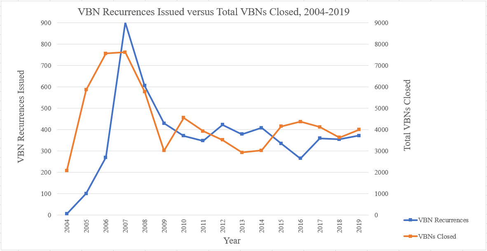
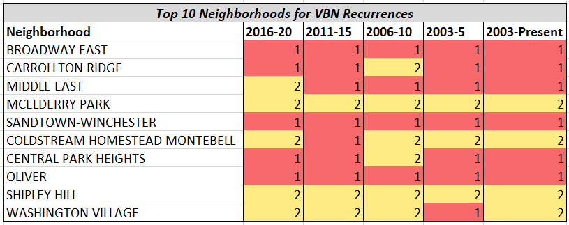
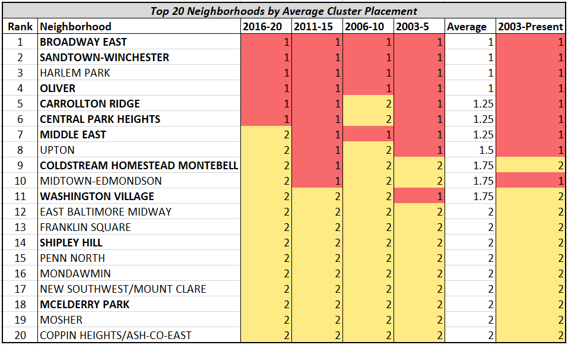
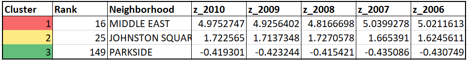
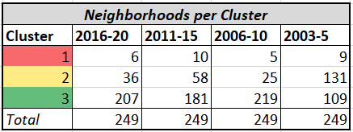

# Improving Neighborhood Health in Baltimore City: An Analysis of Vacant Buildings and the Efficacy of DHCD Interventions

*Project Title
Your project’s title should allude to the project statement and your recommendations, but not be too long. Your title will give the initial context for what the reader is about to digest, so make sure that this is clear and catchy.*

*Main Pitch/Summary/Abstract
This is your pitch for this project. If you ended up in an elevator with the Baltimore City Mayor, how would you explain the project and your findings in less than 4 sentences/1 minute? Use the midterm project template to help with this.* 

*This should briefly touch on things that:
Help answer the Baltimore City team’s initial questions in their problem statement
Mention additional department or division needs based on your findings
Provide concrete steps and/or tools for the Baltimore City team to use this information in their future work*

*__The title and main pitch + any relevant data visualizations should the the only content in your final project GitHub README__*

## Abstract
Placeholder

## Visualizations
### VBN Recurrences
.PNG)   .PNG)

### Cluster Analysis

