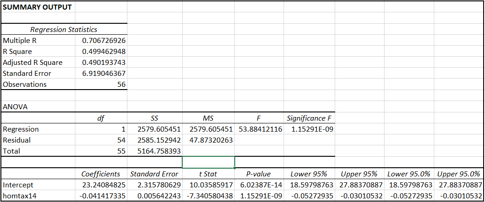
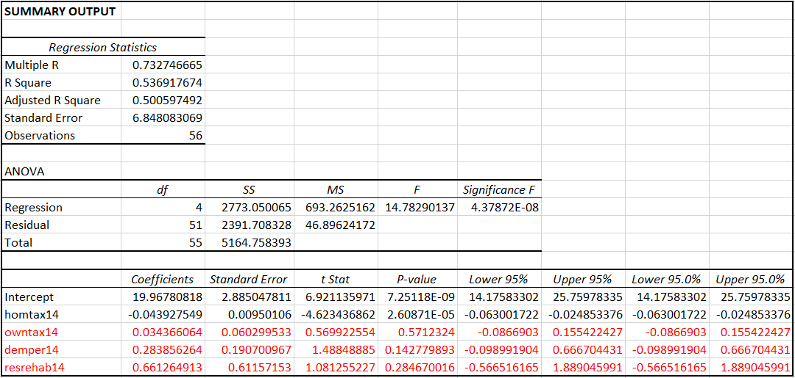
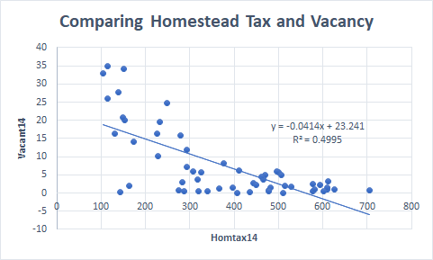
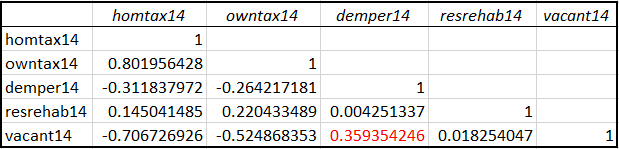
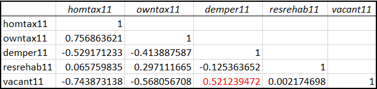

# Improving Neighborhood Health in Baltimore City
## *An Analysis of Vacant Buildings and the Efficacy of DHCD Interventions*

## Pitch
The Baltimore City Code defines vacant buildings as “nuisances per se” and the Department of Housing and Community Development (DHCD) uses them as an indicator of neighborhood health, believing vacant buildings discourage new residents and businesses from moving into the area. Vacant buildings are most prevalent in the “black butterfly” region of Baltimore City and properties in this area are also the most likely to recur on the DHCD’s list of vacancies after being removed. Buildings are removed from the Vacant Building Notice (VBN) list as a result of either demolition or DHCD intervention. While demolitions are obviously highly effective at permanently removing properties from the VBN list, DHCD interventions have also proven highly effective at abating VBNs, especially homestead tax credits. However, further analysis is needed into the factors which cause buildings to become vacant and dilapidated before this problem can be fully solved.

## VBN Recurrences Analysis
.PNG)   .PNG)

Top 10 Neighborhoods by VBN Recurrence Count, with Cluster Analysis Results:

## Cluster Analysis

Example of Z-Scores per Cluster:

## Linear Regression and Correlation Analysis

## VBN Recurrence and DHCD Capital
### VLookup

